# Course Registration System

This is an unknown application written in Java.

---- For Submission (you must fill in the information below) ----

### Use Case Diagram


### Flowchart of the main workflow

```mermaid
flowchart TD
    SID["Student ID found?&#10;look up in students map"]
    CID["Course code found?&#10;look up in courses map"]
    DUP[Already enrolled?]
    FULL[Course full? seats check]
    PRE["All prerequisites met?&#10;check completedCourses list"]
    TIME["Time conflict?&#10;compare TimeSlotOverlaps()"]
    ENROLL["Enroll student&#10;update Student + Course maps"]
    SUCCESS[Return success message]
    FAIL_SID([Fail: not found])
    FAIL_CID([Fail: not found])
    FAIL_DUP([Fail: duplicate])
    FAIL_FULL([Fail: course full])
    FAIL_PRE([Fail: prereq missing])
    FAIL_TIME([Fail: time conflict])
    FAIL_MSG([Return failure message])

    SID -->|pass| CID
    SID -->|fail| FAIL_SID --> FAIL_MSG
    CID -->|pass| DUP
    CID -->|fail| FAIL_CID --> FAIL_MSG
    DUP -->|pass| FULL
    DUP -->|fail| FAIL_DUP --> FAIL_MSG
    FULL -->|pass| PRE
    FULL -->|fail| FAIL_FULL --> FAIL_MSG
    PRE -->|pass| TIME
    PRE -->|fail| FAIL_PRE --> FAIL_MSG
    TIME -->|pass| ENROLL
    TIME -->|fail| FAIL_TIME --> FAIL_MSG
    ENROLL --> SUCCESS

    subgraph Persistence["Persistence DataManager"]
        LOAD["loadData()&#10;Gson ← JSON files"]
        SAVE["saveData()&#10;Gson → JSON files"]
    end

    LOAD -.->|students.json / courses.json| SAVE
```



### Prompts

The following prompts were used with Claude (claude.ai) to generate the Python implementation in the `python/` folder.

---

**Prompt 1 — understanding the program from diagrams:**
> I have a Java course registration system. Here are two diagrams: a use case/navigation flowchart showing Student and Admin menus, and an enrollment validation flowchart showing 6 sequential checks (student ID found, course found, duplicate check, seats check, prerequisites check, time conflict check). Based on these diagrams, select the most interesting use case and create an equivalent Python version of the program. Use JSON files for persistence (data/students.json and data/courses.json), split the code into main.py, enrollment_service.py, and data_manager.py, and implement the full 6-step enrollment validation flow exactly as shown in the flowchart.

---

**Prompt 2 — seed data:**
> Create realistic seed data JSON files for the Python program. students.json should have 2 students with varying completed courses and enrolled courses. courses.json should have 5 courses (CS101, CS201, CS301, MATH101, MATH201) with prerequisites, capacity, time slots in "MWF 9:00-10:00" format, and a costPerCredit field.

---

**Prompt 3 — time conflict logic:**
> Implement a time_slot_overlaps(slot_a, slot_b) function in Python that parses time slot strings like "MWF 9:00-10:00" or "TTH 11:00-12:30" into a set of day characters and start/end minutes, then returns True if two slots share any day and their time ranges overlap.

---

## Python Implementation

**Selected use case: Enroll in Course**

The Python version in `python/` implements the full enrollment validation flow as a CLI application.

### File structure

```
python/
├── main.py               # CLI menus: login, student menu, admin menu
├── enrollment_service.py # Enroll + drop logic with all 6 validations
├── data_manager.py       # load_data() / save_data() using JSON
└── data/
    ├── students.json     # Student records (persisted between runs)
    └── courses.json      # Course catalog (persisted between runs)
```

### How to run

```bash
cd python
python main.py
```

Requires Python 3.10+. No external dependencies.

### Validation flow implemented

| Step | Check | Failure message |
|------|-------|-----------------|
| 1 | Student ID exists | `Student ID '...' not found` |
| 2 | Course code exists | `Course code '...' not found` |
| 3 | Not already enrolled | `You are already enrolled in ...` |
| 4 | Seats available | `... is full (30/30 seats)` |
| 5 | Prerequisites met | `Missing prerequisites: ...` |
| 6 | No time conflict | `Time conflict: ... overlaps with ...` |

### Sample session

```
Login Menu
  [1] Student login
  [2] Admin login
  [3] Exit

> 1
Enter student ID: S001

Student Menu — Alice Johnson
  [2] Enroll in course
> 2
Enter course ID: CS301
✗ Missing prerequisites for CS301: CS201.

> CS201
✓ Successfully enrolled in CS201: Data Structures. Tuition charged: $1,500.00.
```
