# This is an unknown application written in Java

---- For Submission (you must fill in the information below) ----

### Use Case Diagram

```mermaid
flowchart TD
    Start([Start]) --> initData["initData&#10;load JSON or seed defaults"]
    initData --> LoginMenu["Login Menu&#10;1 Student  2 Admin  3 Exit"]
    LoginMenu --> SaveExit([Save & Exit])

    LoginMenu -->|1 Student| StudentLogin["Student login&#10;enter ID or 'new'"]
    StudentLogin -->|new| CreateProfile[Create profile]
    CreateProfile --> StudentMenu
    StudentLogin --> StudentMenu["Student menu&#10;1-6 actions  7 Logout & Save"]

    StudentMenu --> S1[1 View catalog]
    StudentMenu --> S2["2 Register for course&#10;checks: dup, cap, prereq, time conflict"]
    StudentMenu --> S3[3 Drop a course]
    StudentMenu --> S4[4 View schedule]
    StudentMenu --> S5[5 Billing summary]
    StudentMenu --> S6[6 Edit profile]
    StudentMenu --> S7[7 Save & logout]
    S7 -->|back to login| LoginMenu

    LoginMenu -->|2 Admin| AdminLogin["Admin login&#10;password: admin123"]
    AdminLogin --> AdminMenu["Admin menu&#10;1-9 actions  10 Logout & Save"]

    AdminMenu --> A1[1 View catalog]
    AdminMenu --> A2[2 View class roster]
    AdminMenu --> A3[3 View all students]
    AdminMenu --> A4[4 Add student]
    AdminMenu --> A5[5 Edit student]
    AdminMenu --> A6[6 Add course]
    AdminMenu --> A7[7 Edit course]
    AdminMenu --> A8[8 View student schedule]
    AdminMenu --> A9[9 Billing summary]
    AdminMenu --> A10[10 Save & logout]
    A10 -->|back to login| LoginMenu
```


### Flowchart of the main workflow
```mermaid
flowchart TD
    SID["Student ID found?&#10;look up in students map"]
    CID["Course code found?&#10;look up in courses map"]
    DUP[Already enrolled?]
    FULL[Course full? seats check]
    PRE["All prerequisites met?&#10;check completedCourses list"]
    TIME["Time conflict?&#10;compare TimeSlotOverlaps()"]
    ENROLL["Enroll student&#10;update Student + Course maps"]
    SUCCESS[Return success message]
    FAIL_SID([Fail: not found])
    FAIL_CID([Fail: not found])
    FAIL_DUP([Fail: duplicate])
    FAIL_FULL([Fail: course full])
    FAIL_PRE([Fail: prereq missing])
    FAIL_TIME([Fail: time conflict])
    FAIL_MSG([Return failure message])

    SID -->|pass| CID
    SID -->|fail| FAIL_SID --> FAIL_MSG
    CID -->|pass| DUP
    CID -->|fail| FAIL_CID --> FAIL_MSG
    DUP -->|pass| FULL
    DUP -->|fail| FAIL_DUP --> FAIL_MSG
    FULL -->|pass| PRE
    FULL -->|fail| FAIL_FULL --> FAIL_MSG
    PRE -->|pass| TIME
    PRE -->|fail| FAIL_PRE --> FAIL_MSG
    TIME -->|pass| ENROLL
    TIME -->|fail| FAIL_TIME --> FAIL_MSG
    ENROLL --> SUCCESS

    subgraph Persistence["Persistence DataManager"]
        LOAD["loadData()&#10;Gson ← JSON files"]
        SAVE["saveData()&#10;Gson → JSON files"]
    end
    LOAD -. data/students.json · data/courses.json .-> SAVE
```

### Prompts

> You are a senior Java developer. Analyze this Java application codebase and produce the following:
> 1. A use case diagram in Mermaid showing all user roles, their available actions, and navigation flow.
> 2. A flowchart in Mermaid of the course enrollment validation flow, including all failure paths.
> 3. A brief description of the application's purpose, architecture, and persistence strategy.
